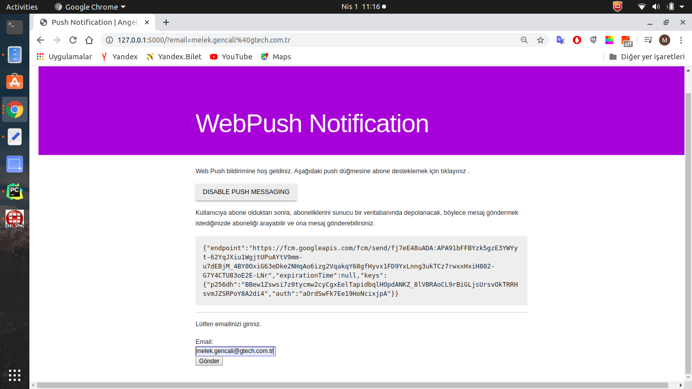
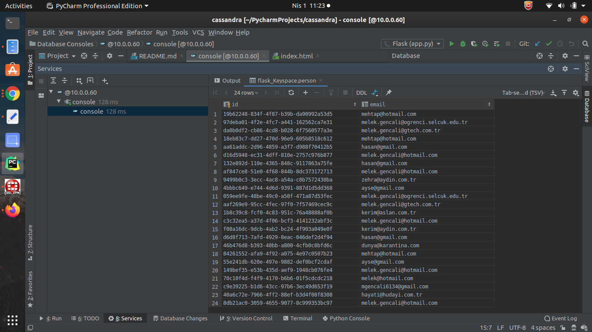

CASSANDRA – PUSH NOTIFICATION
-------------------------------


Hazırlayan: Melek GENÇALİ :blush:


Bu proje pycharm üzerinde gerçekleştirilmiştir. Projede önce restful işlemi gerçekleştirildi. Sonrasında web push işemi gerçekleştirilerek abone emaili cassandra tablosuna eklenildi.
  

Proje adımları :

1- Pycharm üzerinde Flask projesi oluşturulmuştur.

2- Cassandra ‘ yı data source olarak ekleriz:

     -  Database →+ → Data Source → Apache Cassandra
         Cassandra ‘nın kurulu olduğu sunucu adresi , host ve password eklenerek ok denilir.
         Consol üzerinde istenilen keyspace, table vb. işlemleri gerçekleştirilebilir.
	       -  Keyspace Consolda oluşturularak proje içerisinde kullanıldı:  
		            CREATE KEYSPACE "flask_Keyspace"  WITH replication = {'class': 'SimpleStrategy', 'replication_factor' : 1};


3- Proje kodları : 

- Projede ilk restful işlemi gerçekleştirilmiştir. (post-get-delete-update)
-----------------------------------------------------------------------------------------------------------------------------------------------------------------------------------------------------------------------------------------------------------------------------------------------------------------------------------------------------------------------------------

3.1.  App.py adlı dosya oluşturularak içerisinde cassandra bağlantısı gerçekleştirildi. Authotantication eklendi. Blueprint daha sanradan oluşturacağımız api.py içerisinde oluşturulmuş olup bu dosyada kullanılacaktır.


app.py

```
from cassandra.cqlengine import connection
from cassandra.cqlengine.management import sync_table
from flask import Flask
from models.user import Person
from views.api import api
from cassandra.auth import PlainTextAuthProvider

auth_provider = PlainTextAuthProvider(
        username='cassandra', password='cassandra')


def cassandra_conn():

    app = Flask(__name__)
    app.register_blueprint(api)

    return app

app=cassandra_conn()


if __name__ == '__main__':

    connection.setup(['10.0.0.60'], "flask_Keyspace", protocol_version=4, retry_connect=True,

                     auth_provider=auth_provider)

    sync_table(Person)
    app.debug=True
    app.run()

```
---------------------------------------------------------------------------------------------------------------------------------------------------------------------------------------------------------------------------------------------------------------------------------------------------------------------------------------------------------------------------------


3.2. Models adlı bir paket oluşturularak içerisinde base.py adlı bir dosya oluşturuldu.


base.py

```
from cassandra.cqlengine.models import Model

__author__="melek"

class Base(Model):

    __abstract__ = True
    __keyspace__ = "flask_Keyspace"

```
---------------------------------------------------------------------------------------------------------------------------------------------------------------------------------------------------------------------------------------------------------------------------------------------------------------------------------------------------------------------------------


3.3. models paketi  içerinde user.py dosyası oluşturuldu. Burada 3.2 de oluşturulan 'Base ' sınıfı kullanılarak Person adlı bir sınıf oluşturuldu. Oluşturduğumuz keyspace içerisine burada oluşturulan kolonlar
 gönderilerek yapacağımız post, get işlemlerine ortam hazırlandı. 


user.py

```

from cassandra.auth import PlainTextAuthProvider
from models.base import Base 
from  cassandra.cqlengine import columns
import uuid
from cassandra.cqlengine import connection

__author__="melek"


auth_provider = PlainTextAuthProvider(
        username='cassandra', password='cassandra')


connection.setup(['10.0.0.60'], "flask_Keyspace",protocol_version=4,
                 retry_connect=True, auth_provider=auth_provider)

class Person(Base):

    id= columns.UUID(primary_key=True,default=uuid.uuid4)
    email=columns.Text()
   
    def get_data(self):

        return {
            "id":str(self.id),
            "email":self.email

        }

```

--------------------------------------------------------------------------------------------------------------------------------------------------------------------------------------------------------------------------------------------------------------------------------------------------------------------------------------------------


3.4. Scripts adında bir paket oluşturarak içerisinde sync_db.py dosyası oluşturuldu.  Person sınıfında oluşturulan kolonlar sync_table içerisinde create edilir. Bu dosya app.py dosyasından 
çağrılarak kullanılmıştır.


sync_db.py

```

from cassandra.auth import PlainTextAuthProvider
from cassandra.cqlengine import connection
from cassandra.cqlengine.management import sync_table
from models.user import Person

__author__="melek"


auth_provider = PlainTextAuthProvider(
        username='cassandra', password='cassandra')


connection.setup(['10.0.0.60'], "flask_Keyspace",
                 protocol_version=4, retry_connect=True, auth_provider=auth_provider)


sync_table(Person)

```

--------------------------------------------------------------------------------------------------------------------------------------------------------------------------------------------------------------------------------------------------------------------------------------------------------------------------------------------------

3.5. util.py dosyası oluşturuldu. 3.6 da oluşturulacak api.py dosyasında bu dosya kullanılarak json formatında veriler yazdırılacaktır.


util.py
```

import json


__author__ = 'melek'


def to_json(data):

    def handler(obj):
        if hasattr(obj, 'isoformat'):
            return obj.isoformat()

        else:

            raise print(TypeError, 'Object of type %s with value of %s is not JSON serializable' % (type(obj), repr(obj)))


    return json.dumps(data, default=handler)
```


------------------------------------------------------------------------------------------------------------------------------------------------------------------------------------------------------------------------------------------------------------------------------------------------------------------------------------------------


3.6. Sonrasında views adlı paket oluşturarak içerisinde get , post , delete işlemlerini gerçekleştireceğimiz api.py dosyası oluşturuldu.

Flask' deki her görünüm bir işlev olduğundan, dekoratörler bir veya daha fazla işleve ek işlevsellik enjekte etmek için kullanılabilir. Route() Dekoratör muhtemelen kullanılan biridir. 
Ancak kendi dekoratörünüzü uygulamak için kullanım örnekleri vardır. Dekoratör, başka bir işlevi saran ve değiştiren bir işlevdir. Orijinal işlev değiştirildiğinden,  functools.wraps() kullanılarak orijinal işlevin 
bilgilerini yeni işleve kopyalama sağlanılır.


api.py

```

import json
from functools import wraps
import flask
import util
from models.user import Person
from cassandra.cqlengine import connection
from flask import Blueprint, Response, request
from cassandra.auth import PlainTextAuthProvider


__author__="melek"

auth_provider = PlainTextAuthProvider(

        username='cassandra', password='cassandra')


api=Blueprint("api",__name__)
connection.setup(['10.0.0.60'], "flask_Keyspace",protocol_version=4, retry_connect=True, auth_provider=auth_provider)


def json_api(f):

    @wraps(f)
    def decorted_function(*args , **kwargs):
        result = f(*args , **kwargs)
        json_result = util.to_json(result)
        return Response(response=json_result,
                        status=200,mimetype="application/json")

    return decorted_function


@api.route("/",defaults={"path":""})
@api.route('/<path:path>')
def index(path=None):

    return  "Denemelerrr"

@api.route("/add",methods=["POST"])

@json_api

def add_person():
    data=json.loads(flask.request.data)
    person=Person.create(email=data["email"])
    person.save()
    return  person.get_data()


@api.route("/get-all",methods=["GET"])
@json_api
def get_all():

    persons=Person.objects().all()

    return [person.get_data() for person in persons]


@api.route('/delete/<id>', methods=['DELETE'])
def delete__person(id):
    delete = Person.objects.get(id=id).delete()
    return '', 200


@api.route('/put/<id>', methods=['PUT'])
def update_Person(id):
 body = request.get
 Person.objects.get(id=id).update(**body)
 return '', 200

```


-------------------------------------------------------------------------------------------------------------------------------------------------------------------------------------------------------------------------------------------------------------------------------------------------------------------------------------------------------------------------------


4-  app.py dosyası çalıştırıldıktan sonra ' Test RestFul Web Service ' açılır. İlk olarak Post methodu seçilir. Path de ' /add ' verilr ve host/port alanına ' http://localhost:5000 ' yazılır.

 Text yazılan yer açılır ve içerisinde json formatında indexlemek istediğimiz item' ler yazılır.

  
```
  {           
     "email":"melek@gmail.com",  
  } 
```  
	  Ok denilerek çalıştırılır. Tarayıcıda açılarak json kontrol edilir. Get methodu ile tüm json bilgisine ulaşılır. Delete ile istenilen kişi id' si path' de eklenerek silinir.

	--->  http://127.0.0.1:5000/get-all  

-------------------------------------------------------------------------------------------------------------------------------------------------------------------------------------------------------------------------------------------------------------------------------------------------------------------------------------------------------------------------------

5- Web push nasıl çalışır?

Yüksek düzeyde web push çalışmak için üç parti / bileşen gerekir. Onlar:

- İstemci tarafı uygulaması : Kullanıcıların izinlerini ve abonelik jetonunu alır ve arka uç hizmetine gönderir.
- Push Hizmeti : Arka uç servisinden gelen push isteğini doğrular ve push mesajını uygun tarayıcıya iletir.
- Arka uç hizmeti : Kullanıcıların abonelik bilgilerini saklar ve push göndermeyi başlatır.


5.1. Push web push bildirimi gönderme / alma adımları

Kullanıcı, Push API'sı ile iletişim kurarak push izni ve tarayıcı push aboneliği belirteci kabul eder
İstemci uygulaması abonelik bilgilerini arka uç hizmetine göndermeli ve arka uç hizmeti abonelik bilgilerine devam etmeli ve sonraki adımlarda kullanmalıdır.
Arka uç itme servisi push işlemini başlatır ve yükü belirli push servisine gönderir. (Kullanıcıların abonelik bilgilerinde gösterilir.)

Push hizmeti push bildirimini alır ve belirli kullanıcıya ve tarayıcıya bildirimi görüntüler.

5.1.1. Python kullanarak arka uç hizmeti
İstemci uygulaması ve push hizmeti ile iletişim kuracak bir REST arayüzü oluşturacağız. Kullanıcıların abonelik bilgilerini depolayacak ve  VAPID   genel anahtarını dağıtacaktır . VAPID, Gönüllü Uygulama Sunucusu Tanımlaması için kısa terimdir, oluşturulan genel anahtar istemci uygulaması aracılığıyla kullanılacaktır.

5.1.1.1. Web Push işlemini projeye ekleyrek devam edelim.

Aşağıdaki komutu terminalde çalıştırarak VAPID'leri oluşturun:

```
openssl ecparam -name prime256v1 -genkey -noout -out vapid_private.pem
```
Anahtarların base64 kodlu DER temsilini oluşturma :

```
openssl ec -in ./vapid_private.pem -outform DER|tail -c +8|head -c 32|base64|tr -d '=' |tr '/+' '_-' >> private_key.txt

openssl ec -in ./vapid_private.pem -pubout -outform DER|tail -c 65|base64|tr -d '=' |tr '/+' '_-' >> public_key.txt

```
Bu VAPID anahtarları yeni geliştirilen arka uç hizmetinde kullanılacaktır. Web push bildirimini göndermek için pywebpush kütüphanesini kullanacağız. Yeni oluşturulan anahtarları kullanarak push işlemini aşağıdaki gibi yapacağız:

-------------------------------------------------------------------------------------------------------------------------------------------------------------------------------------------------------------------------------------------------------------------------------------------------------------------------------------------------------------------------------
A) app.py dosyasını aşağıdaki gibi güncelleştirelim.

Adımlar:
 
- app.config.update ->> içerisinde configrasyon bilgileri yazıldı.
- Base64 kullanılarak mesaj ve key' ler şifrelenmiştir.
- Private ve public key' ler okunarak VAPID_PRIVATE_KEY ve VAPID_PUBLIC_KEY oluşturuldu.
- VAPID_CLAIMS  abonelik için birincil iletişim e-postasıdır.
- index.html oluşturulup render_template olarak return edilir.
- Html dosyaları template altında yazılır. index.html üzerine sağ tıkla ve 'configure temlates directories' tıkla. Template klasörü oluşturulur.
- push_v1() fonksiyonu içerisinde push mesajı gönderilir.
- email_push() fonksiyonu içerisinde , index.html de girilen eposta çekilir ve person tablosuna yazdırılır.
- subscription() fonksiyonu istemci tarafı uygulaması görevlerini gerçekleştirir ve arka uç hizmetine gönderir.
```
#from marketing_notifications_python.models import app_db
import json
import smtplib
import uuid

from cassandra.cqlengine import connection, columns
from cassandra.cqlengine.connection import cluster
from cassandra.cqlengine.management import sync_table
from flask import Flask, render_template, session, request, flash, jsonify, Response
from werkzeug.datastructures import ImmutableMultiDict

from models.user import Person
from views.api import api
from cassandra.auth import PlainTextAuthProvider
from pywebpush import webpush, WebPushException
import os

from cassandra.cluster import Cluster
auth_provider = PlainTextAuthProvider(
        username='cassandra', password='cassandra')

def cassandra_conn():
    app = Flask(__name__)
    app.register_blueprint(api)

    return app

app=cassandra_conn()


app.config.update(

    #Set the secret key to a sufficiently random value
    SECRET_KEY=os.urandom(24),
    #Set the session cookie to be secure
    SESSION_COOKIE_SECURE=True,
    #Set the session cookie for our app to a unique name
    SESSION_COOKIE_NAME='cassandra-WebSession',
    #Set CSRF tokens to be valid for the duration of the session. This assumes you’re using WTF-CSRF protection
    WTF_CSRF_TIME_LIMIT=None

)


DER_BASE64_ENCODED_PRIVATE_KEY_FILE_PATH = os.path.join(os.getcwd(),"private_key.txt")
DER_BASE64_ENCODED_PUBLIC_KEY_FILE_PATH = os.path.join(os.getcwd(),"public_key.txt")

VAPID_PRIVATE_KEY = open(DER_BASE64_ENCODED_PRIVATE_KEY_FILE_PATH, "r").readline().strip("\n")
VAPID_PUBLIC_KEY = open(DER_BASE64_ENCODED_PUBLIC_KEY_FILE_PATH, "r").read().strip("\n")

# bu abonelik için birincil iletişim e-postasıdır.
VAPID_CLAIMS = {
"sub": "mailto:mgencali6134@gmail.com"
}


def send_web_push(subscription_information, message_body):
    return webpush(
        subscription_info=subscription_information,
        data=message_body,
        vapid_private_key=VAPID_PRIVATE_KEY,
        vapid_claims=VAPID_CLAIMS

    )


@app.route('/')
def index():
    return render_template('index.html')

@app.route("/subscription/", methods=["GET", "POST"])
def subscription():
   
    if request.method == "GET":
        return Response(response=json.dumps({"public_key": VAPID_PUBLIC_KEY}),
            headers={"Access-Control-Allow-Origin": "*"}, content_type="application/json")

    subscription_token = request.get_json("subscription_token")
    return Response(status=201, mimetype="application/json")


@app.route("/email_push/",methods=['POST'])
def email_push():

        email = request.form.get("email")
        print(email)

        #data = json.loads(request.form.get("email"))
        posta = Person.create(email=email)
        posta.save()

        """email = request.form['email']
        print("request form:",request.form)"""

        #item=posta.get_data()
        #return json.dumps({"status": "OK", "email": email})
        return  posta.get_data()


@app.route("/push_v1/",methods=['POST'])
def push_v1():

    message = "size bir bildirimimiz varr :)"
    print("request:",request.data)


    print("is_json",request.is_json)

    if not request.json or not request.json.get('sub_token'):

        return jsonify({'failed':1})

    print("request.json",request.json)

    token = request.json.get('sub_token')
    try:
        token = json.loads(token)
        send_web_push(token, message)


        return jsonify({'success':1})
    except Exception as e:
        print("error",e)
        return jsonify({'failed':str(e)})


if __name__ == '__main__':
    connection.setup(['10.0.0.60'], "flask_Keyspace", protocol_version=4, retry_connect=True,
                     auth_provider=auth_provider)

    sync_table(Person)

    app.debug=True
    app.run()

```
-------------------------------------------------------------------------------------------------------------------------------------------------------------------------------------------------------------------------------------------------------------------------------------------------------------------------------------------------------------------------------

B) static adlı bir paket oluşturup içerisinde main.js adlı javascript dosyası oluşturuldu.

- Kullanıcının tarayıcı üzerinde bildirimlere izin vermesi koşulunda push mesajı atılabilecektir.
- sw.js adında yeni  bir javascript dosyasını içerisinde kullanır.
- push_message() fonksiyonu ve function() fonksiyonu html de gönder butonu click edildiğinde birlikte çalışırlar.
  Yani push işlemi ve email kayıt işlemi aynı anda gerçekleşir.

```
'use strict';

// const applicationServerPublicKey = "BNbxGYNMhEIi9zrneh7mqV4oUanjLUK3m+mYZBc62frMKrEoMk88r3Lk596T0ck9xlT+aok0fO1KXBLV4+XqxYM=";
const pushButton = document.querySelector('.js-push-btn');

let isSubscribed = false;
let swRegistration = null;

function urlB64ToUint8Array(base64String) {
	const padding = '='.repeat((4 - base64String.length % 4) % 4);
	const base64 = (base64String + padding)
		.replace(/\-/g, '+')
		.replace(/_/g, '/');

	const rawData = window.atob(base64);
	const outputArray = new Uint8Array(rawData.length);

	for (let i = 0; i < rawData.length; ++i) {
		outputArray[i] = rawData.charCodeAt(i);
	}
	return outputArray;
}

  
function updateBtn() {
	if (Notification.permission === 'denied') {
		pushButton.textContent = 'Push Messaging Blocked.';
		pushButton.disabled = true;
		updateSubscriptionOnServer(null);
		return;
	}

	if (isSubscribed) {
		pushButton.textContent = 'Disable Push Messaging';
	} else {
		pushButton.textContent = 'Enable Push Messaging';
	}

	pushButton.disabled = false;
}

function updateSubscriptionOnServer(subscription) {
	// TODO: Send subscription to application server

	const subscriptionJson = document.querySelector('.js-subscription-json');
	const subscriptionDetails =
		document.querySelector('.js-subscription-details');

	if (subscription) {
		subscriptionJson.textContent = JSON.stringify(subscription);
		subscriptionDetails.classList.remove('is-invisible');
	} else {
		subscriptionDetails.classList.add('is-invisible');
	}
}

function subscribeUser() {
	const applicationServerPublicKey = localStorage.getItem('applicationServerPublicKey');
	const applicationServerKey = urlB64ToUint8Array(applicationServerPublicKey);
	swRegistration.pushManager.subscribe({
			userVisibleOnly: true,
			applicationServerKey: applicationServerKey
		})
		.then(function(subscription) {
			console.log('User is subscribed.');

			updateSubscriptionOnServer(subscription);
			localStorage.setItem('sub_token',JSON.stringify(subscription));
			isSubscribed = true;

			updateBtn();
		})
		.catch(function(err) {
			console.log('Failed to subscribe the user: ', err);
			updateBtn();
		});
}

function unsubscribeUser() {
	swRegistration.pushManager.getSubscription()
		.then(function(subscription) {
			if (subscription) {
				return subscription.unsubscribe();
			}
		})
		.catch(function(error) {
			console.log('Error unsubscribing', error);
		})
		.then(function() {
			updateSubscriptionOnServer(null);

			console.log('User is unsubscribed.');
			isSubscribed = false;

			updateBtn();
		});
}

function initializeUI() {
	pushButton.addEventListener('click', function() {
		pushButton.disabled = true;
		if (isSubscribed) {
			unsubscribeUser();
		} else {
			subscribeUser();
		}
	});

	// Set the initial subscription value
	swRegistration.pushManager.getSubscription()
		.then(function(subscription) {
			isSubscribed = !(subscription === null);

			updateSubscriptionOnServer(subscription);

			if (isSubscribed) {
				console.log('User IS subscribed.');
			} else {
				console.log('User is NOT subscribed.');
			}

			updateBtn();
		});
}

if ('serviceWorker' in navigator && 'PushManager' in window) {
	console.log('Service Worker and Push is supported');

	navigator.serviceWorker.register("/static/sw.js")
		.then(function(swReg) {
			console.log('Service Worker is registered', swReg);

			swRegistration = swReg;
			initializeUI();
		})
		.catch(function(error) {
			console.error('Service Worker Error', error);
		});
} else {
	console.warn('Push me application Server Public Keyssaging is not supported');
	pushButton.textContent = 'Push Not Supported';
}

function push_message() {
	console.log("sub_token", localStorage.getItem('sub_token'));
	$.ajax({
		type: "POST",
		url: "/push_v1/",
		contentType: 'application/json; charset=utf-8',
		dataType:'json',

		data: JSON.stringify({'sub_token':localStorage.getItem('sub_token')}),
		success: function( data ){
			console.log("success",data);
    },
    error: function( jqXhr, textStatus, errorThrown ){
        console.log("error",errorThrown);
    }
	});
}

$(document).ready(function(){
	$.ajax({
		type:"GET",
		url:'/subscription/',
		success:function(response){
			console.log("response",response);
			localStorage.setItem('applicationServerPublicKey',response.public_key);
		}
	})
});

$(function() {
    $('button').click(function() {
    	  $.ajax({
            url: '/email_push/',
            data: $('form').serialize(),
            type: 'POST',
            success: function(response) {
                console.log(response);
            },
            error: function(error) {
                console.log(error);
            }
        });
    });
});


```

-------------------------------------------------------------------------------------------------------------------------------------------------------------------------------------------------------------------------------------------------------------------------------------------------------------------------------------------------------------------------------

C) sw.js javascript dosyası oluşturuldu.

```
'use strict';

/* eslint-disable max-len */

// const applicationServerPublicKey = "BNbxGYNMhEIi9zrneh7mqV4oUanjLUK3m+mYZBc62frMKrEoMk88r3Lk596T0ck9xlT+aok0fO1KXBLV4+XqxYM=";

/* eslint-enable max-len */

function urlB64ToUint8Array(base64String) {
  const padding = '='.repeat((4 - base64String.length % 4) % 4);
  const base64 = (base64String + padding)
    .replace(/\-/g, '+')
    .replace(/_/g, '/');

  const rawData = window.atob(base64);
  const outputArray = new Uint8Array(rawData.length);

  for (let i = 0; i < rawData.length; ++i) {
    outputArray[i] = rawData.charCodeAt(i);
  }
  return outputArray;
}

self.addEventListener('push', function(event) {
  console.log('[Service Worker] Push Received.');
  console.log(`[Service Worker] Push had this data: "${event.data.text()}"`);

  const title = 'Push Message !!';
  const options = {
    body: `"${event.data.text()}"`,
    icon: 'images/icon.png',
    badge: 'images/badge.png'
  };

  event.waitUntil(self.registration.showNotification(title, options));
});

self.addEventListener('notificationclick', function(event) {
  console.log('[Service Worker] Notification click Received.');

  event.notification.close();

  event.waitUntil(
    clients.openWindow('http://www.gtech.com.tr/')
  );
});

self.addEventListener('pushsubscriptionchange', function(event) {
  console.log('[Service Worker]: \'pushsubscriptionchange\' event fired.');
  const applicationServerPublicKey = localStorage.getItem('applicationServerPublicKey');
  const applicationServerKey = urlB64ToUint8Array(applicationServerPublicKey);
  event.waitUntil(
    self.registration.pushManager.subscribe({
      userVisibleOnly: true,
      applicationServerKey: applicationServerKey
    })
    .then(function(newSubscription) {
      // TODO: Send to application server
      console.log('[Service Worker] New subscription: ', newSubscription);
    })
  );
});


```


-------------------------------------------------------------------------------------------------------------------------------------------------------------------------------------------------------------------------------------------------------------------------------------------------------------------------------------------------------------------------------

D) templates/index.html dosyası oluşturuldu.


```

<!DOCTYPE html>
<html lang="">

<head>
	<meta charset="utf-8">
	<meta http-equiv="X-UA-Compatible" content="IE=edge">
	<meta name="viewport" content="width=device-width, initial-scale=1.0">

	<title>Push Notification | Angel !! </title>

	<link rel="stylesheet" href="https://fonts.googleapis.com/icon?family=Material+Icons">
	<link rel="stylesheet" href="https://code.getmdl.io/1.2.1/material.indigo-pink.min.css">
	<script defer src="https://code.getmdl.io/1.2.1/material.min.js"></script>
	<script src="https://code.jquery.com/jquery-3.4.1.min.js" integrity="sha256-CSXorXvZcTkaix6Yvo6HppcZGetbYMGWSFlBw8HfCJo=" crossorigin="anonymous"></script>
	<link rel="stylesheet" href="{{ url_for('static', filename='index.css') }}">
</head>

<body>

	<header>
		<h1>WebPush Notification</h1>
	</header>

	<main>
		<p>Web Push bildirimine hoş geldiniz. Aşağıdaki push düğmesine abone desteklemek için tıklayınız .</p>
		<p>
			<button disabled class="js-push-btn mdl-button mdl-js-button mdl-button--raised mdl-js-ripple-effect">
				Enable Push Messaging
			</button>
		</p>
		<section class="subscription-details js-subscription-details is-invisible">
			<p>Kullanıcıya abone olduktan sonra, aboneliklerini sunucu bir veritabanında depolanacak, böylece mesaj göndermek istediğinizde
aboneliği arayabilir ve ona mesaj gönderebilirsiniz.</p>
			<pre><code class="js-subscription-json"></code></pre>
<hr>
			<p>Lütfen emailinizi giriniz. </p>
                   <form>
                     <label for="email">Email: </label><br>
                     <input type="text" id="email" name="email"><br>
                      <button type="submit" class="EmailAccount" onclick="push_message()" >Gönder</button>
                  </form>
<!--
            <hr>
            <button id='hidebutton'>hide</button>
		    <form id='myForm'>
			    <p>Push bildirimini aşağıda test edebilirsiniz.</p>

            <button type="submit" class="mdl-button mdl-js-button mdl-button--raised mdl-button--colored" onclick="push_message()">Test Push Notification</button>
	        </form>-->

        </section>
	</main>

	<script src="{{ url_for('static',filename='main.js') }}"></script>
	<script src="https://code.getmdl.io/1.2.1/material.min.js"></script>
</body>


</html>


```

-------------------------------------------------------------------------------------------------------------------------------------------------------------------------------------------------------------------------------------------------------------------------------------------------------------------------------------------------------------------------------

E) static/index.css dosyası oluşturuldu. 

```

html {
  height: 100%;
}

html, body {
  width: 100%;
  padding: 10px;
  margin: 0;
}

body {
  min-height: auto;
  box-sizing: border-box;
}

header {
  padding: 115px 0 32px 0;
  background-color: #9658d4;
  color: #ffffff;
}

main, header > h1 {
  padding: 0 16px;
  max-width: 760px;
  box-sizing: border-box;
  margin: 0 auto;
}

main {
  margin: 24px auto;
  box-sizing: border-box;
}

pre {
  white-space: pre-wrap;
  background-color: #EEEEEE;
  padding: 16px;
}

pre code {
  word-break: break-word;
}

.is-invisible {
  opacity: 0;
}

.subscription-details {
  transition: opacity 1s;
}

@media (max-width: 600px) {
  header > h1 {
    font-size: 36px;
  }
}

```

-------------------------------------------------------------------------------------------------------------------------------------------------------------------------------------------------------------------------------------------------------------------------------------------------------------------------------------------------------------------------------

6. Projemizi çalıştıralım. 

- Enable Push Messaging butonuna tıklanır ve bildirimlere izin ver denilir.

  
   
- Email girilir ve gönder butonuna tıklanılır.

  
  
- Person tablosu kontrol edilir.

  
- Tarayıcıda ' http://127.0.0.1:5000/get-all ' ile tüm email bilgileri listelenilir. 

  


